# Defence Prep Aug 2022

from: https://cgvr.cs.ut.ee/thesis-preparation/

## Preparation

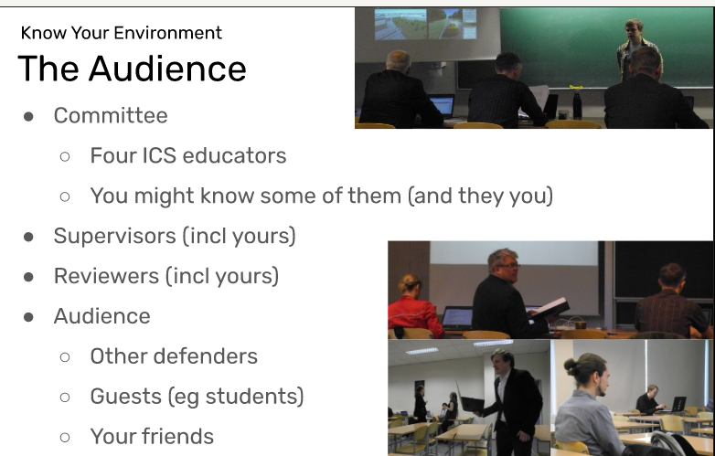

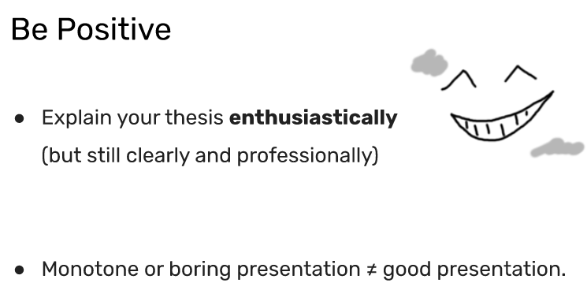

## Slides Structure

### Slides: The Beginning

Introduce yourself

Dear committee and audience, my name is Enlik and I presenting to you my Master thesis titled “Topic Modeling for Requirements Engineering: An Analysis of Ridesharing App Reviews”.

Topic Modeling is one of the unsupervised machine learning techniques that is useful to discover the abstract “topic” from a collection of text documents. In this case, we used text documents from app reviews.

NLP
RE
Ridesharing app reviews
Result of my thesis

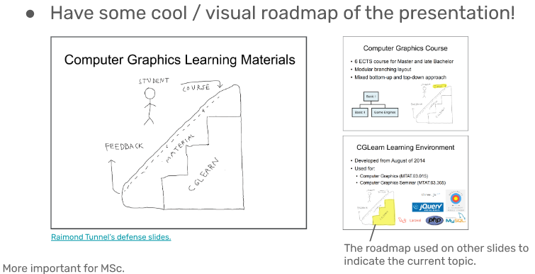

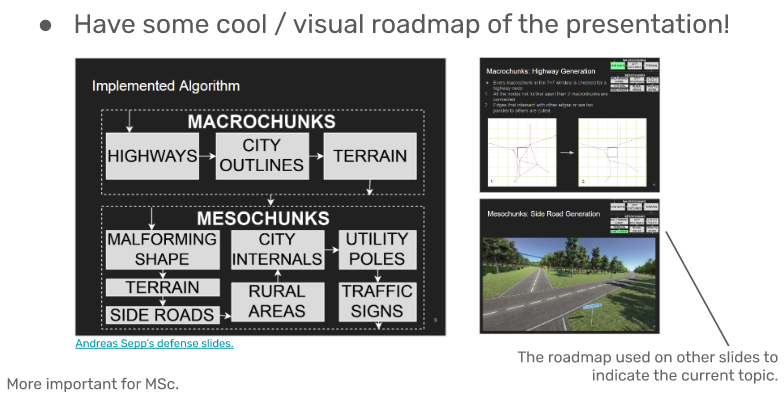

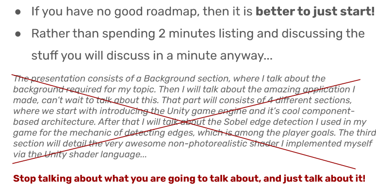

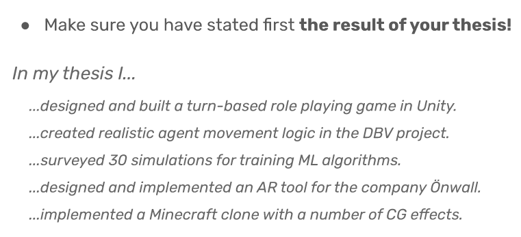

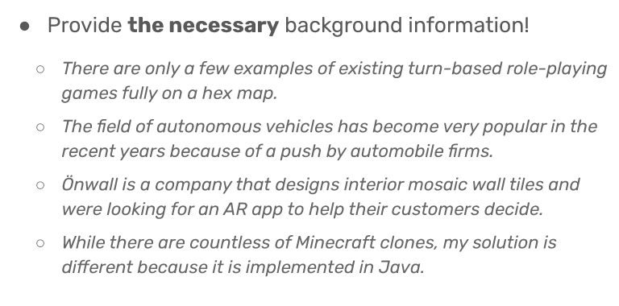

### Slides: The Mid

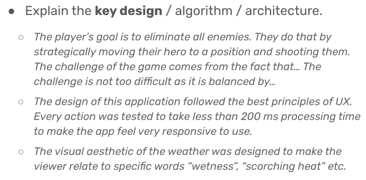

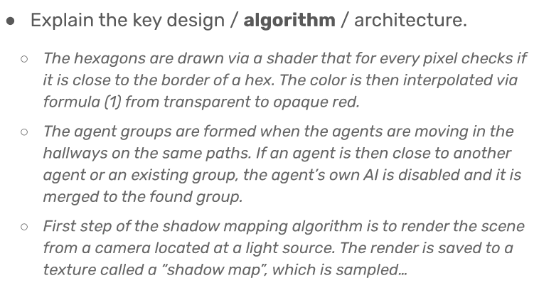

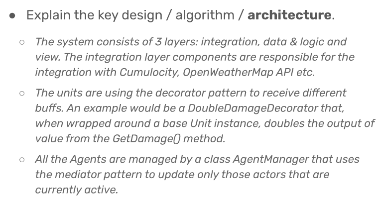

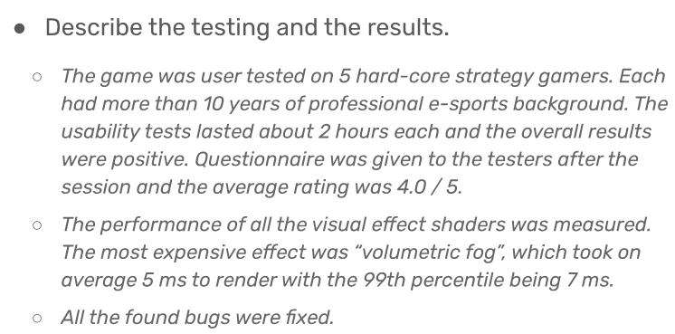

### Slides: The End

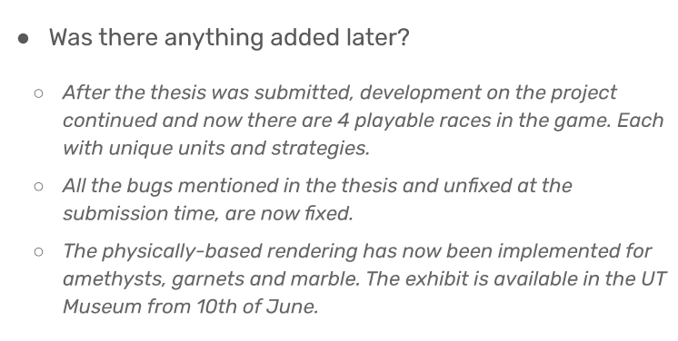

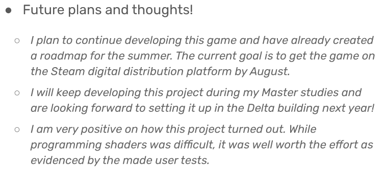

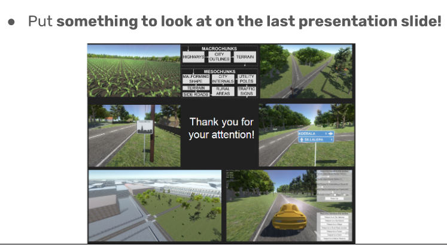

### General Info

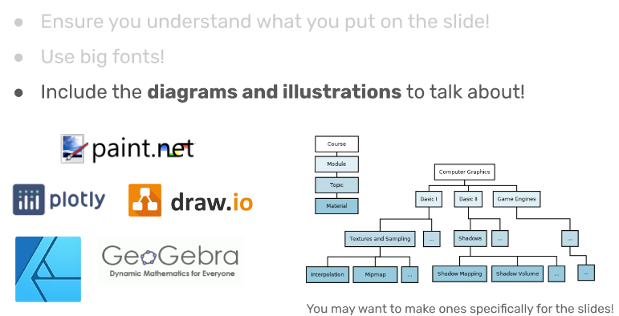

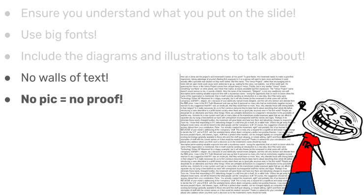

- Memorize your slides' order and content
- Written notes are OK, but don't just read from them
- Add slide numbers

### Acting

Confidence:

- You are the master of your topic
- Look at the back of the room (not at your feet)
- Speak in a clear loud voice
- It's the culmination of my 3 years of work study, be PROUD!
- Don't be overconfident!

### The Discussion and Final Words

- Answer with **dedicated slides** after the main ones
- Follow slide guidelines

If you can't answer the questions:
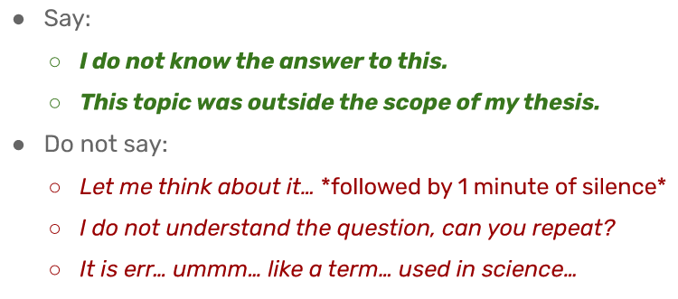

### Final Words Slide

Prepare your final (1 minute) words

Thanks to:

- Tahira Iqbal and Kuldar Taveter - for supervising me during the past 2 years working on this thesis
- Committee and participant of this thesis defence
- UT High Performance Computing, for giving me an access to cloud GPU-powered computing power for running BERT deep learning model.
- University of Tartu, Institute of Computer Science, for the facility, library, and resources that provided to finish this thesis

### Extra Effort

- Dress formally
- Bow in the end
- Include 1 joke

## Tips

Tips from July 27, 2021:
Reduce technical details on presentation slide

## References

https://cgvr.cs.ut.ee/thesis-preparation/
https://cgvr.cs.ut.ee/of-thesis-writing-part-5-the-defense-and-future/

How to avoid death By PowerPoint | David JP Phillips | TEDxStockholmSalon
2014
https://youtu.be/Iwpi1Lm6dFo

Slide presentation reference:
SOFTWARE REQUIREMENTS ENGINEERING Individual Presentation
https://www.youtube.com/watch?v=F6dTyq6rqU8

What is Sentiment Analysis
[https://drive.google.com/file/d/15tiV3BNXfZa0ftkCiNnT4jiehEK_TRPr/view](https://drive.google.com/file/d/15tiV3BNXfZa0ftkCiNnT4jiehEK_TRPr/view?authuser=0)

NLP for RE
Natural Language Processing (NLP) for Requirements Engineering (RE): an Overview
https://www.slideshare.net/alessio_ferrari/presentation-tbicseferrari

